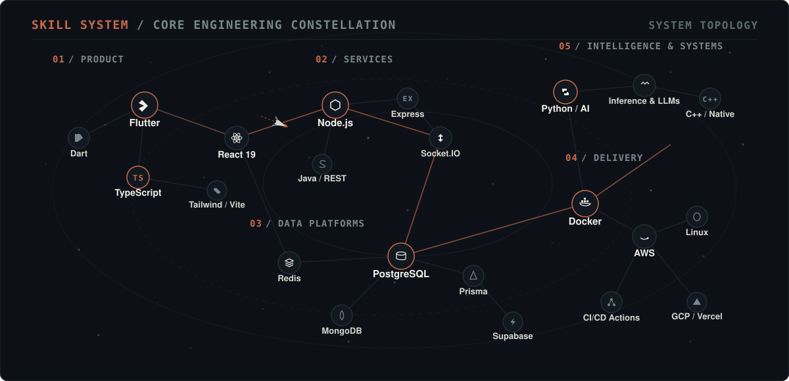

<picture>
  <source media="(prefers-color-scheme: dark)" srcset="./assets/identity/hero-editorial-dark.svg">
  <source media="(prefers-color-scheme: light)" srcset="./assets/identity/hero-editorial-light.svg">
  
</picture>

 

<table border="0" cellpadding="0" cellspacing="0" width="100%">
  <tr>
    <td width="3" bgcolor="#C96A4B" style="background:#C96A4B; width:3px; padding:0; border:none;"></td>
    <td width="16" style="width:16px; padding:0; border:none;"></td>
    <td style="padding:0; border:none;">
      

        I engineer and deliver production systems end to end, from product interfaces and backend services to data platforms, AI capabilities, cloud infrastructure, and deployment. My focus is software that moves from architecture to operation as a coherent system: observable, maintainable, and designed for real-world load.
      

    </td>
  </tr>
</table>

 

<!-- ================================================================= -->
<!-- 03 — SKILL CONSTELLATION                                          -->
<!-- ================================================================= -->
<picture>
  <source media="(prefers-color-scheme: dark)" srcset="./assets/skills/constellation-dark.svg">
  <source media="(prefers-color-scheme: light)" srcset="./assets/skills/constellation-light.svg">
  
</picture>

  

<!-- ================================================================= -->
<!-- 04 — REPOSITORY STATISTICS & METRICS                              -->
<!-- ================================================================= -->
<picture>
  <source media="(prefers-color-scheme: dark)" srcset="./assets/telemetry/stats-editorial-dark.svg">
  <source media="(prefers-color-scheme: light)" srcset="./assets/telemetry/stats-editorial-light.svg">
  
</picture>

  

<!-- ================================================================= -->
<!-- 05 — CONTRIBUTION ACTIVITY TIMELINE                               -->
<!-- ================================================================= -->
<picture>
  <source media="(prefers-color-scheme: dark)" srcset="./assets/telemetry/activity-chart-dark.svg">
  <source media="(prefers-color-scheme: light)" srcset="./assets/telemetry/activity-chart-light.svg">
  
</picture>

  

<!-- ================================================================= -->
<!-- 06 — LANGUAGE FOOTPRINT                                           -->
<!-- ================================================================= -->
<picture>
  <source media="(prefers-color-scheme: dark)" srcset="./assets/telemetry/domain-spectrum-dark.svg">
  <source media="(prefers-color-scheme: light)" srcset="./assets/telemetry/domain-spectrum-light.svg">
  
</picture>

  

<!-- ================================================================= -->
<!-- 07 — ENGINEERING SCOPE & SYSTEMS CROSS-SECTION                    -->
<!-- ================================================================= -->
<picture>
  <source media="(prefers-color-scheme: dark)" srcset="./assets/architecture/system-stack-dark.svg">
  <source media="(prefers-color-scheme: light)" srcset="./assets/architecture/system-stack-light.svg">
  
</picture>

  

<!-- ================================================================= -->
<!-- 08 — CORE ENGINEERING PRINCIPLES                                  -->
<!-- ================================================================= -->
<picture>
  <source media="(prefers-color-scheme: dark)" srcset="./assets/principles/engineering-stances-dark.svg">
  <source media="(prefers-color-scheme: light)" srcset="./assets/principles/engineering-stances-light.svg">
  
</picture>

  

<!-- ================================================================= -->
<!-- 09 — PROFESSIONAL CLOSING MASTHEAD & FOOTER                       -->
<!-- ================================================================= -->
<picture>
  <source media="(prefers-color-scheme: dark)" srcset="./assets/footer/footer-editorial-dark.svg">
  <source media="(prefers-color-scheme: light)" srcset="./assets/footer/footer-editorial-light.svg">
  
</picture>
