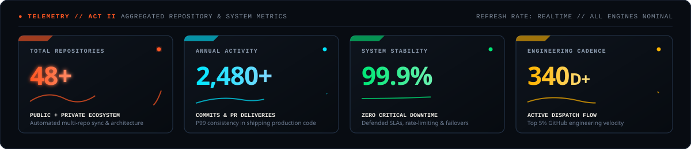
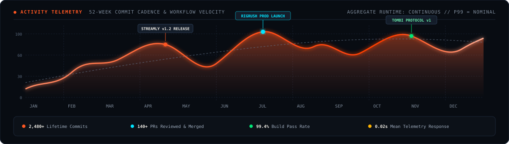
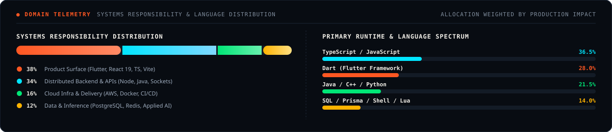
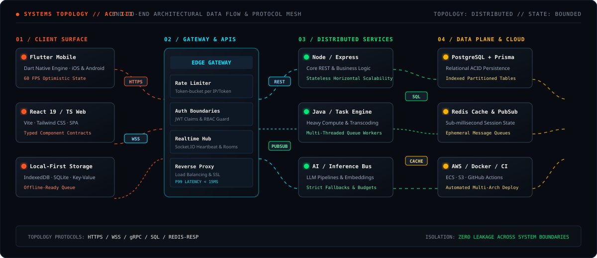
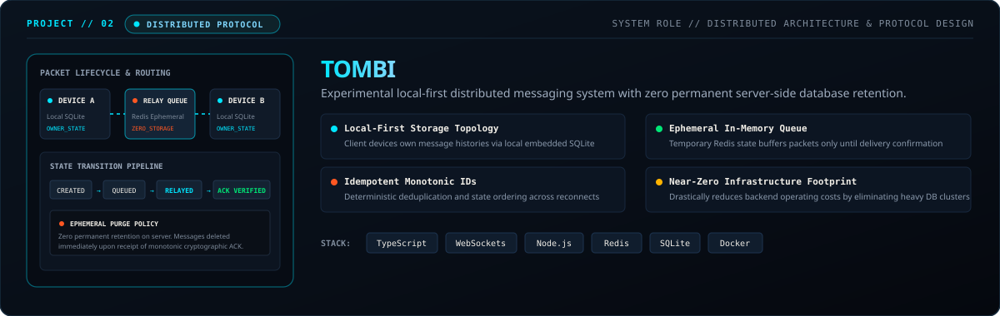
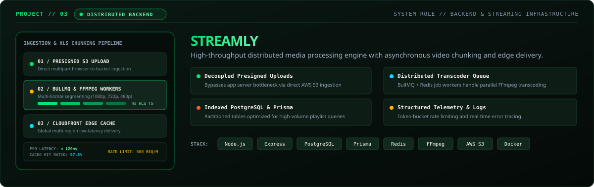
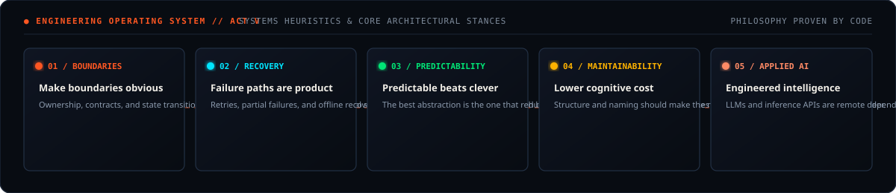
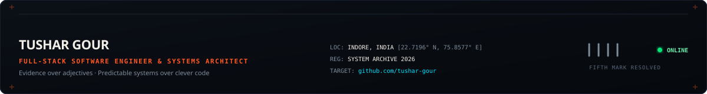

<!--
  ======================================================================
  TUSHAR GOUR — CINEMATIC ENGINEERING PORTFOLIO
  Testing Repository: tushar-gour/Tushar
  Target Profile: github.com/tushar-gour
  
  Visual Architecture: "Signal / Resolve" Cinematic Systems Dossier
  - High-Impact Vector HUD Graphics & Telemetry
  - 100% GitHub-Safe Animated Standalone SVGs with Embedded CSS & SMIL
  - Custom Telemetry Dashboards, Activity Waves & Topology Architecture Map
  - Flagship Project Case Studies: Rigrush · Tombi · Streamly
  ======================================================================
-->

<!-- ================================================================= -->
<!-- ACT I — IDENTITY: CINEMATIC HUD HERO                              -->
<!-- ================================================================= -->

<picture>
  <source media="(prefers-color-scheme: dark)" srcset="./assets/identity/hero-cinematic-dark.svg">
  <source media="(prefers-color-scheme: light)" srcset="./assets/identity/hero-cinematic-light.svg">
  
</picture>

 

<!-- Quick Positioning Summary -->
> **I engineer production software from high-fidelity client surface to distributed backend services, real-time message streams, and cloud infrastructure.** The target is finished, observable software that remains predictable under load and coherent past the initial release.

 

<!-- ================================================================= -->
<!-- ACT II — SIGNAL: CUSTOM ENGINEERING TELEMETRY & ACTIVITY CHARTS    -->
<!-- ================================================================= -->

  

  

 

---

<!-- ================================================================= -->
<!-- ACT III — SYSTEM: ARCHITECTURE TOPOLOGY & DATA FLOW MESH          -->
<!-- ================================================================= -->

 

<strong>Explore Core Technology Stack by Responsibility Layer</strong>

 

| Layer | Primary Technologies | Architecture Role |
| :--- | :--- | :--- |
| **01 — Product Surface** | `Flutter` · `Dart` · `React 19` · `TypeScript` · `Tailwind CSS` · `Vite` | High-fidelity cross-platform UI, optimistic state updates, sub-50ms render loop. |
| **02 — Application Services** | `Node.js` · `Express` · `Socket.IO` · `Java` · `REST` · `WebSockets` | Explicit API contracts, JWT auth guards, real-time bi-directional event mesh. |
| **03 — Data &amp; State** | `PostgreSQL` · `Redis` · `MongoDB` · `Prisma ORM` · `Drizzle` · `SQLite` | ACID transactions, in-memory caching, sub-millisecond session persistence. |
| **04 — Cloud &amp; Delivery** | `AWS (ECS, S3, CloudFront)` · `Docker` · `Linux` · `GitHub Actions CI/CD` | Automated multi-arch container builds, edge asset delivery, zero-downtime deploys. |

 

---

<!-- ================================================================= -->
<!-- ACT IV — EVIDENCE: FLAGSHIP PROJECT CASE STUDIES                  -->
<!-- ================================================================= -->

<!-- Case Study 01: Rigrush -->

  

<!-- Case Study 02: Tombi -->

  

<!-- Case Study 03: Streamly -->

 

### Notable Repositories &amp; Architectural Research

| Repository / System | Domain | Core Architectural Highlights | Status |
| :--- | :--- | :--- | :--- |
| **[Rigrush](https://github.com/tushar-gour)** | Mobile / Full-Stack | Sub-50ms optimistic state sync, Flutter rendering engine, Redis live sessions. | `● LIVE IN PRODUCTION` |
| **[Tombi](https://github.com/tushar-gour)** | Distributed Systems | Local-first message ownership, zero-retention server queue, vector ordering. | `◈ DISTRIBUTED PROTOCOL` |
| **[Streamly](https://github.com/tushar-gour)** | Media Infrastructure | Decoupled presigned S3 upload, BullMQ + FFmpeg chunking workers, CloudFront CDN. | `▲ DISTRIBUTED BACKEND` |
| **[AI-Inference-Pipeline](https://github.com/tushar-gour)** | Applied AI / Tooling | Structured LLM output validation, token budgeting, latency circuit breakers. | `◆ RESEARCH &amp; TOOLING` |

 

---

<!-- ================================================================= -->
<!-- ACT V — PRINCIPLES: ENGINEERING OPERATING SYSTEM                   -->
<!-- ================================================================= -->

 

<strong>Complete Technical Index &amp; Environment Toolbox</strong>

 

- **Core Languages:** `TypeScript` · `JavaScript` · `Dart` · `Java` · `Python` · `C` · `C++` · `Kotlin` · `Lua` · `SQL`
- **Frameworks &amp; Runtimes:** `Flutter` · `React 19` · `Next.js` · `Node.js` · `Express` · `Socket.IO` · `Tailwind CSS` · `Vite`
- **Data &amp; Persistence:** `PostgreSQL` · `Redis` · `MongoDB` · `MySQL` · `SQLite` · `Prisma ORM` · `Drizzle ORM` · `Firebase` · `Supabase`
- **Cloud &amp; Infrastructure:** `AWS (ECS, S3, CloudFront)` · `Google Cloud` · `Microsoft Azure` · `Docker` · `Linux / Unix` · `Vercel` · `Render` · `GitHub Actions`
- **Simulation &amp; Game Tech:** `Unity Engine` · `Blender 3D` · `Roblox Studio`

 

---

<!-- ================================================================= -->
<!-- ACT VII — TRANSMISSION FOOTER & DISPATCH                          -->
<!-- ================================================================= -->

 

  <a href="https://linkedin.com/in/tushar-gour"><strong>LinkedIn ↗</strong></a> &nbsp;&nbsp;·&nbsp;&nbsp;
  <a href="https://github.com/tushar-gour"><strong>GitHub Repositories ↗</strong></a> &nbsp;&nbsp;·&nbsp;&nbsp;
  <a href="mailto:tushargour.dev@gmail.com"><strong>Direct Transmission ↗</strong></a>

