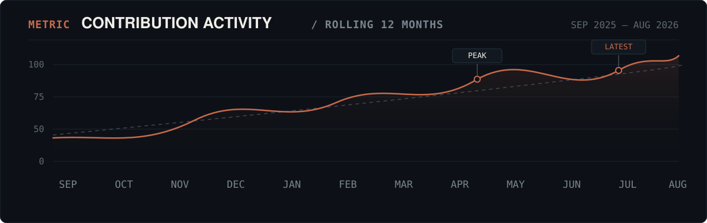
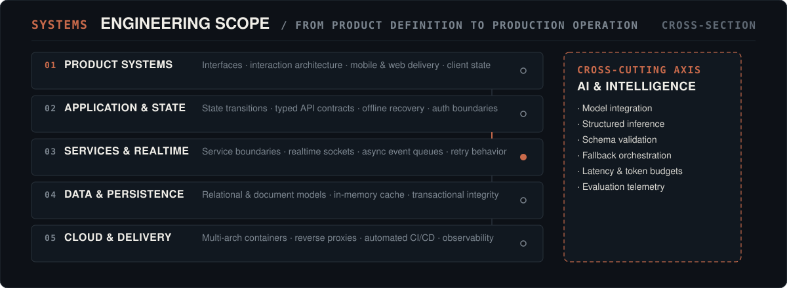
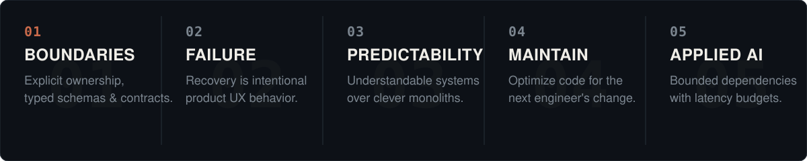

<picture>
  <source media="(prefers-color-scheme: dark)" srcset="./assets/identity/hero-editorial-dark.svg">
  <source media="(prefers-color-scheme: light)" srcset="./assets/identity/hero-editorial-light.svg">
  
</picture>

 

I build production software across mobile, web, backend services, and cloud infrastructure — from the client surface down to the systems and persistence running underneath. The focus is finished software: applications that ship, services that remain predictable under real load, and architectures that stay coherent past the first version.

 

<!-- ================================================================= -->
<!-- 02 — REPOSITORY STATISTICS & CADENCE                              -->
<!-- ================================================================= -->
<picture>
  <source media="(prefers-color-scheme: dark)" srcset="./assets/telemetry/stats-editorial-dark.svg">
  <source media="(prefers-color-scheme: light)" srcset="./assets/telemetry/stats-editorial-light.svg">
  
</picture>

  

<!-- ================================================================= -->
<!-- 03 — CONTRIBUTION ACTIVITY TIMELINE                               -->
<!-- ================================================================= -->
<picture>
  <source media="(prefers-color-scheme: dark)" srcset="./assets/telemetry/activity-chart-dark.svg">
  <source media="(prefers-color-scheme: light)" srcset="./assets/telemetry/activity-chart-light.svg">
  
</picture>

  

<!-- ================================================================= -->
<!-- 04 — SECOND DATA VISUAL: LANGUAGE FOOTPRINT                       -->
<!-- ================================================================= -->
<picture>
  <source media="(prefers-color-scheme: dark)" srcset="./assets/telemetry/domain-spectrum-dark.svg">
  <source media="(prefers-color-scheme: light)" srcset="./assets/telemetry/domain-spectrum-light.svg">
  
</picture>

  

<!-- ================================================================= -->
<!-- 05 — CAPABILITY & SYSTEM RELATIONSHIPS MAP                        -->
<!-- ================================================================= -->
<picture>
  <source media="(prefers-color-scheme: dark)" srcset="./assets/architecture/system-stack-dark.svg">
  <source media="(prefers-color-scheme: light)" srcset="./assets/architecture/system-stack-light.svg">
  
</picture>

  

<!-- ================================================================= -->
<!-- 06 — CORE ENGINEERING PRINCIPLES                                  -->
<!-- ================================================================= -->
<picture>
  <source media="(prefers-color-scheme: dark)" srcset="./assets/principles/engineering-stances-dark.svg">
  <source media="(prefers-color-scheme: light)" srcset="./assets/principles/engineering-stances-light.svg">
  
</picture>

  

<!-- ================================================================= -->
<!-- 07 — COLLAPSIBLE TECHNICAL TOOLBOX                                -->
<!-- ================================================================= -->

<strong>The complete technical toolbox</strong> — languages, platforms, and environments

 

- **Languages** &nbsp;—&nbsp; TypeScript · JavaScript · Dart · Java · Python · C · C++ · Kotlin · Lua · SQL
- **Frameworks &amp; Runtime** &nbsp;—&nbsp; Flutter · React 19 · Next.js · Node.js · Express · Socket.IO · Tailwind CSS · Vite
- **Data &amp; Persistence** &nbsp;—&nbsp; PostgreSQL · Redis · MongoDB · MySQL · SQLite · Prisma · Drizzle · Supabase
- **Cloud &amp; Infrastructure** &nbsp;—&nbsp; AWS · Google Cloud · Docker · Linux · GitHub Actions CI/CD · Vercel · Render
- **Tools &amp; Graphics** &nbsp;—&nbsp; Git · Unity · Blender · Postman · Figma

 

<!-- ================================================================= -->
<!-- 08 — FOOTER & DIRECTORY LINKS                                     -->
<!-- ================================================================= -->
<picture>
  <source media="(prefers-color-scheme: dark)" srcset="./assets/footer/footer-editorial-dark.svg">
  <source media="(prefers-color-scheme: light)" srcset="./assets/footer/footer-editorial-light.svg">
  
</picture>

 

[LinkedIn ↗](https://linkedin.com/in/tushar-gour) &nbsp;&nbsp;·&nbsp;&nbsp; [GitHub Repositories ↗](https://github.com/tushar-gour)

