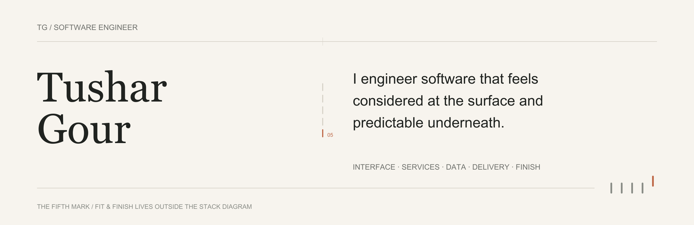

<!--
  Tushar Gour — GitHub Profile README
  Revised: 2026-08

  Asset pipeline: SVG source → tools/render_static.py → committed PNG renders
  Motion: tools/render_motion.py → committed GIF
  No third-party badge, stat, or animation services.

  Visual system: "Signal / Resolve"
  The accent mark in each phase divider is displaced at Phase 01
  and settles to exact alignment by Phase 04. The fifth-mark.gif
  shows the same arc in motion. The profile's form mirrors its thesis:
  engineering takes things from disorder to resolved.
-->

<picture>
  <source media="(prefers-color-scheme: dark)" srcset="./assets/identity/hero-dark.png">
  <source media="(prefers-color-scheme: light)" srcset="./assets/identity/hero-light.png">
  
</picture>

I build across mobile, web, and backend — from interface to the infrastructure running beneath it. The target is finished software: applications that ship, services that hold under real load, and systems that remain coherent past the first version.

When intelligence genuinely improves the product, I treat it as a capability inside the system — not as the system's identity.

### Across the stack, by responsibility

**01 — Product surface**  
Flutter · Dart · React · TypeScript · Tailwind CSS · Vite  
Interfaces where state, navigation, latency, and API contract are designed together — not handed off in stages.

**02 — Service behavior**  
Node.js · Express · Socket.IO · JWT · Java  
HTTP and real-time services built around explicit contracts, authorization boundaries, and recoverable failure states.

**03 — Data & persistence**  
PostgreSQL · MongoDB · Redis · MySQL · Prisma · Drizzle  
Schemas, queries, caching, and persistence choices shaped around access patterns rather than fashion.

**04 — Delivery & infrastructure**  
AWS · Azure · Google Cloud · Linux · Git · GitHub · Vercel · Render  
The path from a passing build to deployed software — environments, storage, secrets, and the operational behavior that runs afterward.

### The fifth layer is not a framework.

Testing. Validation. Edge cases. Documentation. Naming. Recovery behavior. Small inconsistencies users notice before they can explain them.

Those details rarely appear in a stack diagram, but they decide whether software feels assembled or finished.

  

### How I judge the work

**Make boundaries obvious.**  
A system is easier to reason about when ownership, contracts, and state transitions are explicit.

**Treat failure paths as product behavior.**  
Retries, invalid input, offline state, partial failure, and recovery deserve design — not cleanup.

**Prefer predictable operation over clever implementation.**  
The best abstraction is the one that keeps paying rent after the first version ships.

**Leave the source easier to change.**  
Structure, naming, and documentation should reduce the cost of the next decision.

**When intelligence enters the system, engineer it accordingly.**  
LLMs, embeddings, and inference APIs are dependencies like any other — they need defined contracts, fallback behavior, latency budgets, and versioning.

<strong>The wider toolbox</strong> — supporting languages, platforms, and environments

 

**Languages**  
Dart · Java · C · C++ · JavaScript · TypeScript · Python · Kotlin · Lua

**Frameworks & runtime**  
Flutter · React · React Router · Node.js · Express · Tailwind CSS · Bootstrap · Vite · Socket.IO

**Data & backend services**  
Redis · MongoDB · MySQL · PostgreSQL · Firebase · Supabase · Prisma · Drizzle

**Cloud & delivery**  
AWS · Azure · Google Cloud · Vercel · Netlify · Render · NPM

**Tools & creative software**  
Git · GitHub · Windows Terminal · Unity · Blender · Canva · Roblox Studio

**Operating environments**  
Windows · Linux · Ubuntu · macOS

---

*Evidence over adjectives.*

The repositories below are where architecture decisions, implementation trade-offs, and finished details can be inspected directly.

**Tushar Gour** · Software Engineer · [LinkedIn ↗](https://linkedin.com/in/tushar-gour)
