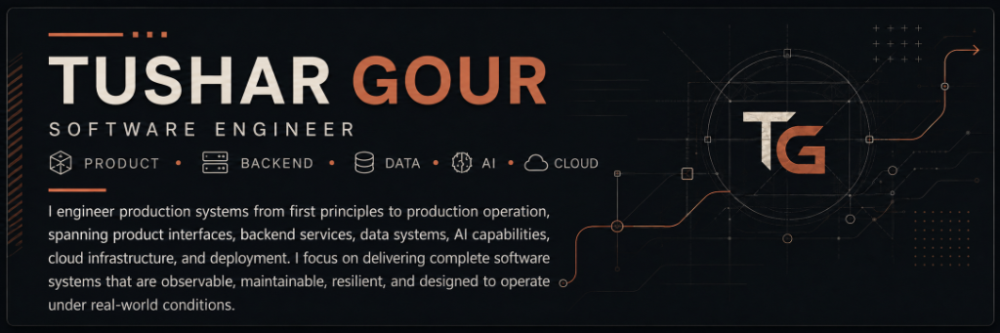
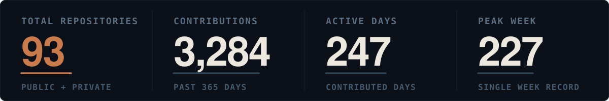
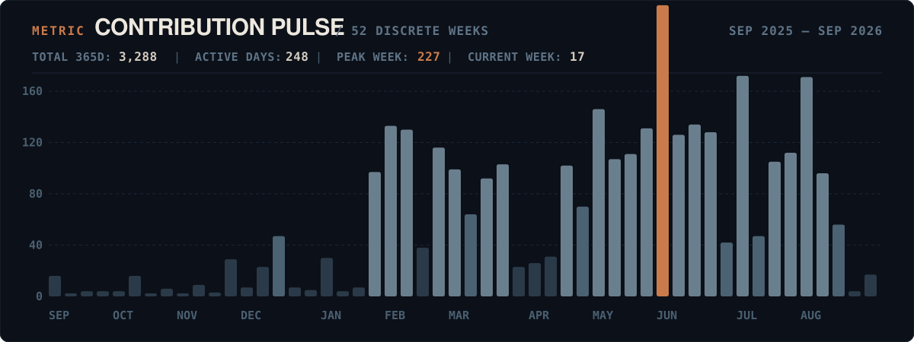
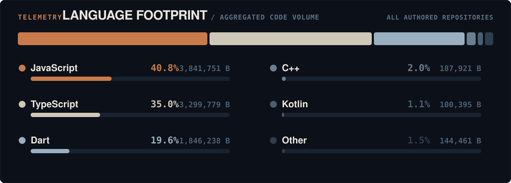
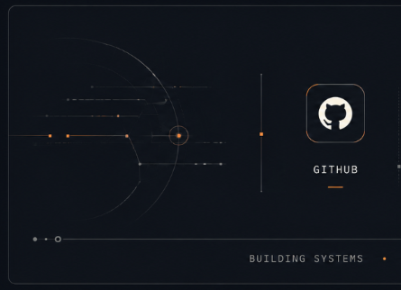
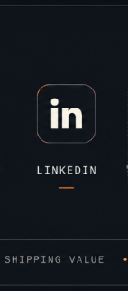
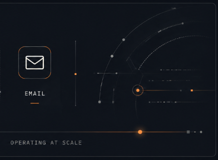

  

<!-- ================================================================= -->
<!-- 02 — ENGINEERING STACK & SIGNAL LANES                             -->
<!-- ================================================================= -->
<picture>
  <source media="(prefers-color-scheme: dark)" srcset="./assets/skills/toolchain-dark.svg">
  <source media="(prefers-color-scheme: light)" srcset="./assets/skills/toolchain-light.svg">
  
</picture>

  

<!-- ================================================================= -->
<!-- 03 — GITHUB METRICS & REPOSITORY STATISTICS (LOCKED)              -->
<!-- ================================================================= -->
<picture>
  <source media="(prefers-color-scheme: dark)" srcset="./assets/telemetry/stats-editorial-dark.svg">
  <source media="(prefers-color-scheme: light)" srcset="./assets/telemetry/stats-editorial-light.svg">
  
</picture>

  

<!-- ================================================================= -->
<!-- 04 — 52-WEEK CONTRIBUTION PULSE (LOCKED)                          -->
<!-- ================================================================= -->
<picture>
  <source media="(prefers-color-scheme: dark)" srcset="./assets/telemetry/pulse-52w-dark.svg">
  <source media="(prefers-color-scheme: light)" srcset="./assets/telemetry/pulse-52w-light.svg">
  
</picture>

  

<!-- ================================================================= -->
<!-- 05 — LANGUAGE FOOTPRINT (LOCKED)                                  -->
<!-- ================================================================= -->
<picture>
  <source media="(prefers-color-scheme: dark)" srcset="./assets/telemetry/domain-spectrum-dark.svg">
  <source media="(prefers-color-scheme: light)" srcset="./assets/telemetry/domain-spectrum-light.svg">
  
</picture>

  

<!-- ================================================================= -->
<!-- 06 — PROFESSIONAL IDENTITY FOOTER                                 -->
<!-- ================================================================= -->

