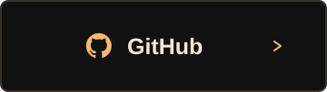
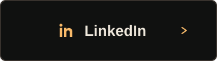

<picture>
  <source media="(prefers-color-scheme: dark)" srcset="./assets/identity/hero-gold.png">
  <source media="(prefers-color-scheme: light)" srcset="./assets/identity/hero-gold-light.png">
  
</picture>

<!-- ================================================================= -->
<!-- ENGINEERING STACK & SIGNAL LANES                             -->
<!-- ================================================================= -->
<picture>
  <source media="(prefers-color-scheme: dark)" srcset="./assets/skills/toolchain-dark.svg">
  <source media="(prefers-color-scheme: light)" srcset="./assets/skills/toolchain-light.svg">
  
</picture>

<!-- ================================================================= -->
<!-- ENGINEERING ACTIVITY                                         -->
<!-- ================================================================= -->
<picture>
  <source media="(prefers-color-scheme: dark)" srcset="./assets/telemetry/pulse-52w-dark.svg">
  <source media="(prefers-color-scheme: light)" srcset="./assets/telemetry/pulse-52w-light.svg">
  
</picture>

<!-- ================================================================= -->
<!-- LANGUAGE FOOTPRINT (LOCKED)                                  -->
<!-- ================================================================= -->
<picture>
  <source media="(prefers-color-scheme: dark)" srcset="./assets/telemetry/domain-spectrum-dark.svg">
  <source media="(prefers-color-scheme: light)" srcset="./assets/telemetry/domain-spectrum-light.svg">
  
</picture>

<!-- ================================================================= -->
<!-- PROFESSIONAL IDENTITY FOOTER                                 -->
<!-- ================================================================= -->

<a href="https://github.com/tushar-gour"><picture><source media="(prefers-color-scheme: dark)" srcset="./assets/footer/github-dark.svg"><source media="(prefers-color-scheme: light)" srcset="./assets/footer/github-light.svg"></picture></a> <a href="https://www.linkedin.com/in/tushar-gour/"><picture><source media="(prefers-color-scheme: dark)" srcset="./assets/footer/linkedin-dark.svg"><source media="(prefers-color-scheme: light)" srcset="./assets/footer/linkedin-light.svg"></picture></a> <a href="mailto:tushargour004@gmail.com"><picture><source media="(prefers-color-scheme: dark)" srcset="./assets/footer/email-dark.svg"><source media="(prefers-color-scheme: light)" srcset="./assets/footer/email-light.svg"></picture></a>

